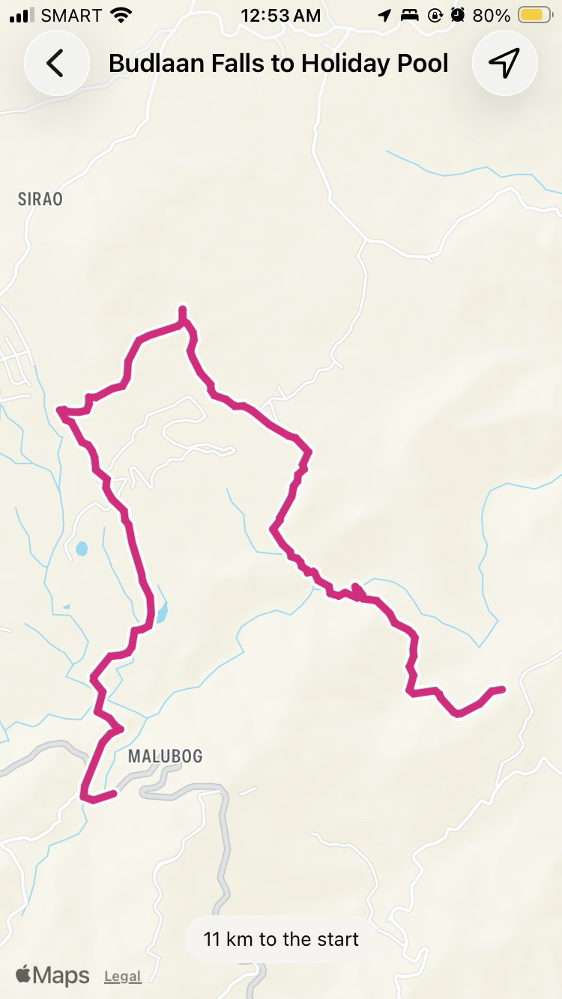
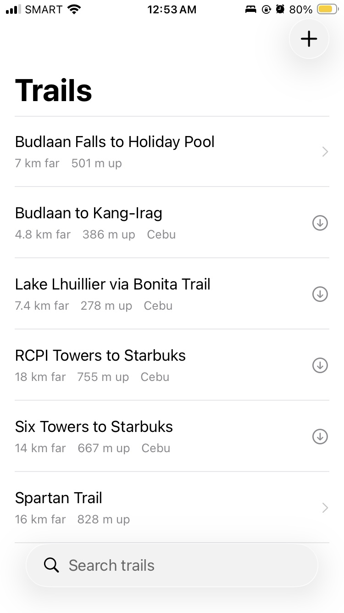

# Gabay

An iPhone app that shows you a trail on a map and shows where you are on it. Free, no account, no subscription.

Gabay is Filipino for guide.

- iOS 17+ · Swift 6 · Xcode 26 · no third-party dependencies

| | |
|---|---|
|  |  |
| The route, your position, and how far the start is | Published trails and your own imports, in one list |

## Why this exists

Hiring a guide prices people out of hiking their own mountains. The trails are public, the maps are public, and the phone in your pocket already has a GPS receiver that works without a cell tower.

The software is where it stops being free.

AllTrails and Strava both charge for the one thing a hiker on an unfamiliar trail actually needs: loading a route somebody else made and following it. Recording your own activity is free on both. Uploading a finished walk is free on Strava. Following a line up a mountain you have never climbed is not.

So the gap is narrow and specific: **follow a GPX you did not create, without paying.** Nobody serves it because there is no business in it.

Gabay fills it from the other end. The trails are curated and given away, the app follows them, and your walk stays on your phone as a file you can take anywhere, including to Strava.

If you hike a handful of times a year, a subscription is poor value for the one screen you need. This is that screen.

## What it does

- Lists trails published in this repository, with distance, climb and region
- Downloads one when you open it, and keeps it on the phone
- Draws the route on the map with your position and which way you are facing
- Tells you how far you are from the start
- Imports any GPX file you already have, from Files, an email, or AirDrop
- Deletes anything you no longer want

No sign up, no analytics, no server. Where you walk is not information this app sends anywhere.

## What it does not do yet

**The map goes grey with no signal.** MapKit downloads its basemap from Apple's servers and offers no way to keep it, so on a ridge with no bars the terrain disappears.

What survives is the part that matters most: the route line and your position are drawn from data already on the phone, so the screen becomes a magenta line on grey with a dot on it. The question a lost hiker asks is "am I still on the trail", and a line with a dot on it answers that. What is lost is context.

Two sentences, and the app must not blur them: **the route works offline, the map does not.**

A real offline basemap is the planned upgrade. See [the spec](docs/design/gabay.md).

## The trails

Trails live in [`trails/`](trails) and are served over GitHub Pages. The app reads `catalog.json` on launch, shows what it lists, and fetches a GPX only when somebody taps one.

```
https://patrickechavez.github.io/gabay/trails/catalog.json
```

Adding a trail is a commit, not an App Store release. Upload the `.gpx` into `trails/`, add its block to `catalog.json`, and every phone picks it up on its next launch with a connection. The format is documented in [`trails/README.md`](trails/README.md).

Three rules keep the refresh from eroding the offline promise:

- **Silent.** It never blocks a screen, never spins, never raises an error.
- **Cheap.** The app sends the ETag it holds and does nothing on a 304.
- **Additive.** Nothing is ever deleted from under you. A trail dropped from the catalogue stays on the phone of anyone who already has it.

The files are public on purpose. They are useful to somebody even if they never install this app.

## Bringing your own GPX

Tap `+` and pick a file. Anything with a `<trk>` or a `<rte>` works, including exports from Strava, Garmin, Komoot, Wikiloc and Gaia. The app measures it rather than trusting what the file claims, and once imported it is indistinguishable from a published trail.

Parsing is `XMLParser` from Foundation. No dependency, and it keeps whatever it read from a truncated file rather than refusing the lot.

## Where things live on the phone

```
Application Support/
├── catalog.json   the last catalogue seen, so the list is there before the network is
└── Trails/        one GPX per trail, downloaded and imported alike
```

Not `Caches`, which iOS empties without warning when storage runs low. The file system is the database: if the file is there, the trail is there.

## Building

Nothing to configure. Clone, open, run.

```bash
xcodebuild -scheme Development -destination 'platform=iOS Simulator,name=iPhone 17 Pro' build
```

Three schemes, three configurations, one shared base in `Config/`. They install side by side, so a development build never replaces the one you hike with.

| | Development | Staging | Production |
|---|---|---|---|
| Bundle ID | `.dev` | `.staging` | *(none)* |
| Logging | on | off | off |

The only value that reaches code from the xcconfigs is `CATALOG_URL`, so pointing a build at a different set of trails is a one line change.

Location needs a real device to mean anything. The simulator has no magnetometer, so the heading cone stays hidden there.

## Structure

```
Gabay/
├── App/           entry point, composition root
├── Core/
│   ├── Trails/    GPX parsing, the trail store, the catalogue client
│   ├── UI/        LoadState, error states
│   └── Observability/
├── DesignSystem/  theme
├── Features/
│   └── Trail/     the list, the map, the walker
└── Resources/     String Catalog
```

Views hold no logic. A view model owns the state, and everything below it sits behind a protocol, which is what lets the tests run without a network, a GPS or a disk of their own.

```bash
xcodebuild test -scheme Development -destination 'platform=iOS Simulator,name=iPhone 17 Pro'
```

## Not built yet

Recording your own walk and exporting it as a GPX is designed and written, on the `recording` branch rather than here.

```bash
git checkout recording
```

Still to come after that: a real offline basemap through downloadable region packs, and an off route warning.

## Attribution

Maps and their attribution come from Apple, through MapKit. Trail data is recorded on foot and published here.
